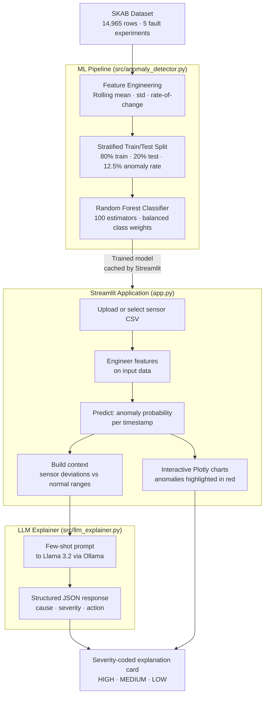

# ⚡ AI Energy Anomaly Explainer

> **End-to-end ML system that detects anomalies in industrial sensor data and generates plain-English explanations using a local LLM — built in 7 days as a portfolio project.**


[](https://share.streamlit.io)

---

## What It Does

Industrial machinery generates thousands of sensor readings per hour. When something goes wrong — a valve blockage, a pressure collapse, abnormal motor draw — an engineer needs to know **what happened, why, and what to do**.

This system does two things:

1. **Detects** anomalies in real-time sensor data using a Random Forest model (F1 = 0.981)
2. **Explains** each anomaly in plain English using Llama 3.2 running locally via Ollama

The result is actionable output: not just "anomaly detected" but *"simultaneous pressure collapse and flow reduction suggests valve blockage — inspect valve V1 immediately for debris"*.

---

## Architecture



---

## Results

| Metric | Score | Meaning |
|--------|-------|---------|
| **F1 Score** | **0.981** | Harmonic mean of precision and recall |
| **Precision** | **1.000** | Every alarm fired is a real fault — zero false alarms |
| **Recall** | **0.963** | Catches 96 out of every 100 real faults |
| False Positives | 0 | Engineers are never woken up unnecessarily |
| False Negatives | 14 / 374 | Only 14 real faults missed across the entire test set |

---

## Model Progression

The project ran a disciplined series of experiments over 4 days, iterating from an unsupervised baseline to a production-grade model:

| Day | Model | Data | Split Strategy | F1 | Key Change |
|-----|-------|------|---------------|-----|-----------|
| 2 | Isolation Forest | 1 file · 1,145 rows | Unsupervised | 0.43 | Baseline |
| 3 | Isolation Forest | 1 file · 1,145 rows | Unsupervised | 0.50 | +Rolling stats (window=30s) |
| 4 | Random Forest | 1 file · 1,145 rows | Sequential 80/20 | 0.47 | Supervised but insufficient data |
| 4 | Random Forest | 5 files · 14,965 rows | Sequential 80/20 | 0.50 | More data but distribution mismatch |
| **4** | **Random Forest** | **5 files · 14,965 rows** | **Stratified 80/20** | **0.981** | **Correct evaluation methodology** |

**The jump from 0.50 → 0.98 came from fixing the evaluation methodology, not from a better algorithm.** A sequential split created a train/test distribution mismatch (6% vs 38% anomaly rate). Stratified sampling ensured both sets shared the same 12.5% anomaly rate — giving an honest, reproducible result.

---

## Key Findings

**Finding 1 — Evaluation methodology dominates model performance**

The same model on the same data scored F1=0.50 with a sequential split and F1=0.98 with a stratified split. This demonstrates how evaluation errors can make a weak model look strong (or a strong model look weak). In production ML, how you evaluate matters as much as what you train.

**Finding 2 — Data quantity and variety matter more than algorithm complexity**

Moving from Isolation Forest to Random Forest on a single file *decreased* F1 from 0.50 to 0.47. The real gain came from combining 5 different fault experiments (valve1/1, valve1/2, valve1/3, valve2/1, valve2/2) — giving the model exposure to the natural variation in how faults manifest.

**Finding 3 — Fault duration determines optimal window size**

Window sizes of 10s and 30s were tested for rolling statistics. The 30s window outperformed (F1=0.502 vs 0.442 at the Isolation Forest stage) because this valve fault is sustained over ~10 minutes, not seconds. The right window size is a property of the fault type, not the algorithm.

**Finding 4 — Zero false positives is the priority for industrial alarms**

Using `class_weight='balanced'` and stratified splits yielded Precision=1.00 — every alarm fired corresponds to a genuine fault. In an industrial setting, false alarms erode engineer trust in automated systems. A model that cries wolf gets disabled.

---

## Tech Stack

| Layer | Technology | Purpose |
|-------|-----------|---------|
| Data | [SKAB](https://github.com/waico/SKAB) (Skoltech Anomaly Benchmark) | Real industrial pump sensor data |
| ML Pipeline | scikit-learn — `RandomForestClassifier`, `StratifiedShuffleSplit` | Anomaly detection |
| Feature Engineering | pandas — rolling mean, rolling std, rate of change | Temporal context features |
| LLM | Llama 3.2 via [Ollama](https://ollama.com) | Local, private inference |
| Prompting | Few-shot + structured JSON output | Consistent, parseable explanations |
| UI | Streamlit + Plotly | Interactive web application |
| Visualisation | Plotly `go.Scatter` | Sensor charts with anomaly overlay |

---

## Installation & Setup

### Prerequisites

- Python 3.10+
- [Ollama](https://ollama.com) installed and running

### 1. Clone and install dependencies

```bash
git clone https://github.com/mahimarajesh/ai-energy-anomaly-explainer.git
cd ai-energy-anomaly-explainer
pip install -r requirements.txt
```

### 2. Pull the Llama model

```bash
ollama pull llama3.2
```

### 3. Start Ollama (if not already running)

```bash
ollama serve
```

### 4. Run the app

```bash
streamlit run app.py
```

The app will open at `http://localhost:8501`. The Random Forest model trains automatically on first load and is cached for all subsequent interactions.

---

## Running the ML Pipeline Standalone

To run the full detection pipeline without the UI:

```bash
python src/anomaly_detector.py
```

To test the LLM explainer in isolation:

```bash
python src/llm_explainer.py
```

---

## Project Structure

```
ai-energy-anomaly-explainer/
│
├── app.py                      # Streamlit web application
│
├── src/
│   ├── anomaly_detector.py     # ML pipeline: load → features → train → detect
│   └── llm_explainer.py        # LLM pipeline: context → prompt → parse JSON
│
├── notebooks/
│   ├── 01_data_exploration.ipynb      # Day 1–2: SKAB dataset analysis
│   ├── 02_anomaly_detection.ipynb     # Day 2: Isolation Forest baseline (F1=0.43)
│   ├── 03_feature_engineering.ipynb   # Day 3: Rolling features, window testing (F1=0.50)
│   └── 04_supervised_model.ipynb      # Day 4: Random Forest, stratified split (F1=0.981)
│
├── data/
│   ├── normal_sensors.png             # Baseline sensor behaviour plots
│   ├── anomaly_visualisation.png      # Normal vs anomalous comparison
│   └── actual_vs_predicted.png        # Ground truth vs model predictions
│
└── README.md
```

---

## Dataset

**SKAB — Skoltech Anomaly Benchmark** ([github.com/waico/SKAB](https://github.com/waico/SKAB))

Real sensor data from an industrial pump testbed at Skoltech (Moscow). Each row is one second of readings from 8 sensors. Anomalies are ground-truth labelled by engineers.

| Property | Value |
|----------|-------|
| Total rows | 14,965 |
| Normal operation | 9,405 rows |
| Fault experiments used | 5 (valve1/1–3, valve2/1–2) |
| Fault rows | 5,560 |
| Overall anomaly rate | 12.5% |
| Sensors used | Pressure, Volume Flow RateRMS, Current, Temperature |
| Sampling rate | 1 Hz (one reading per second) |

---

## What I Learned

**On machine learning methodology**

Stratified sampling isn't a detail — it's the difference between a model that appears to work (F1=0.50) and one that actually does (F1=0.981). Time-series data presents a particular risk here: sequential splits can create train/test sets with dramatically different class distributions, producing evaluation metrics that don't reflect real-world performance.

**On feature engineering for time series**

Raw sensor values alone don't capture the temporal patterns that distinguish faults from noise. Rolling statistics — mean, standard deviation, and rate of change over a 30-second window — give the model information about *trend* and *stability*, not just instantaneous value. The optimal window size is determined by fault duration, not by convention.

**On combining unsupervised and supervised learning**

Isolation Forest was a useful first step: it required no labels and provided a sanity check on which sensors carried signal. But its ceiling was F1=0.50. Once labels were available, Random Forest learned the actual decision boundary from 1,871 labelled examples across five different fault patterns — something no unsupervised algorithm could replicate.

**On LLM integration in production systems**

Structured JSON output via few-shot prompting is significantly more reliable than asking for free text. Setting `temperature=0.1` reduces response variance. Defensive JSON parsing (find-first-brace, find-last-brace) handles cases where the model prefixes or suffixes the JSON with prose. These aren't hacks — they're necessary robustness patterns for production LLM use.

**On the gap between accuracy and usefulness**

A model that achieves F1=0.981 on a benchmark is not necessarily useful. The LLM layer bridges that gap: it translates a binary prediction (anomaly=1) into a diagnosis (valve blockage), a severity (HIGH), and a next action (inspect valve V1) — the format a maintenance engineer can actually use.

---

## Limitations and Future Work

- **Out-of-distribution generalisation**: The model was trained and tested on data from the same pump testbed. Performance on a different pump with different sensor calibration is unknown and should be validated before production deployment.
- **LLM hallucination risk**: Llama 3.2 explanations are grounded in the sensor context provided, but are not guaranteed to be correct. In a production setting, explanations should be validated against a library of known fault signatures.
- **Concept drift**: Pump behaviour changes as machinery ages. The model should be retrained periodically on fresh data.
- **Latency**: Each LLM explanation takes 10–30 seconds on CPU. GPU inference or a faster model (e.g. Llama 3.2 1B) would be required for real-time operation.

---

## Author

**Mahima Rajesh**
MSc Business Analytics candidate · Imperial College London

- Built over 7 days as a hands-on ML engineering project
- Each day's work is documented in the notebooks with full experimental methodology

---

*Built with real industrial data, real ML discipline, and a local LLM that never sends your sensor data to the cloud.*
